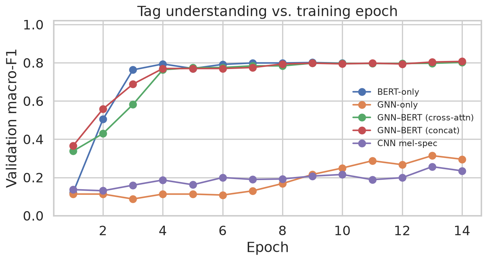
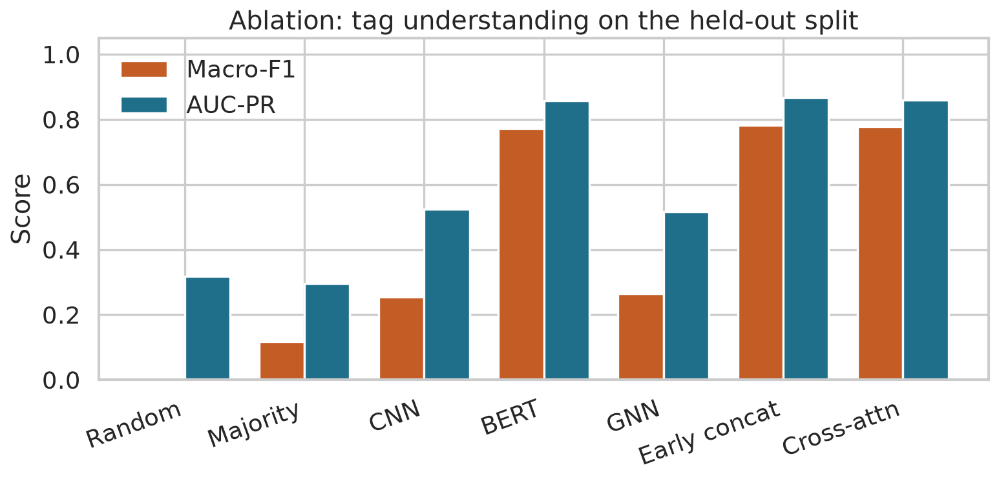
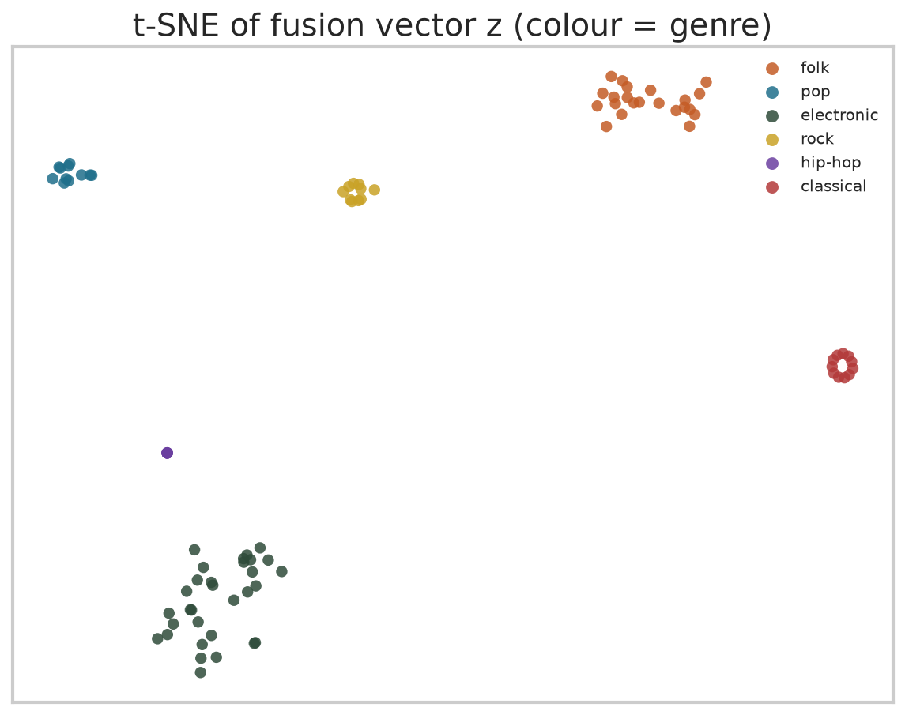
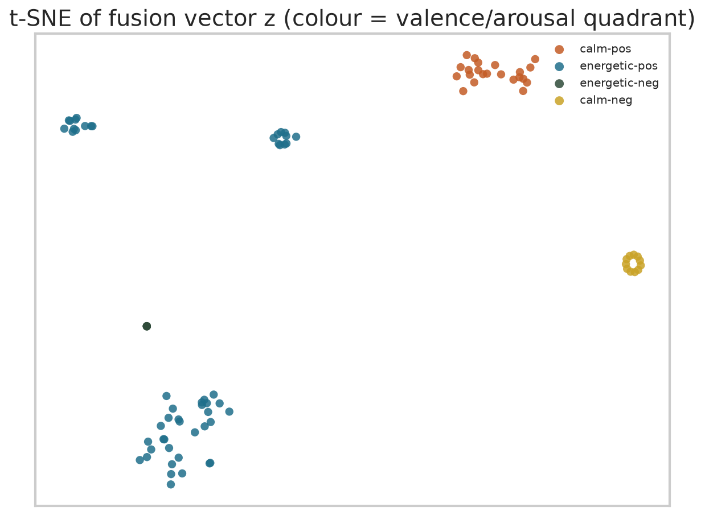
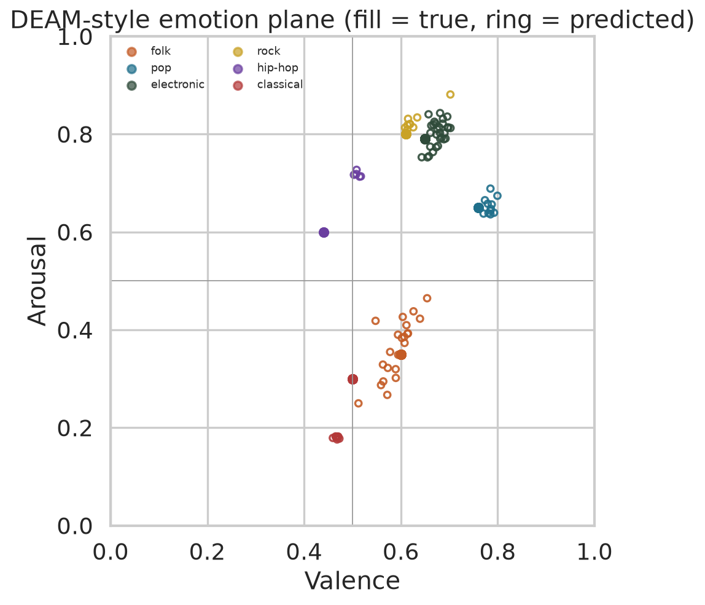
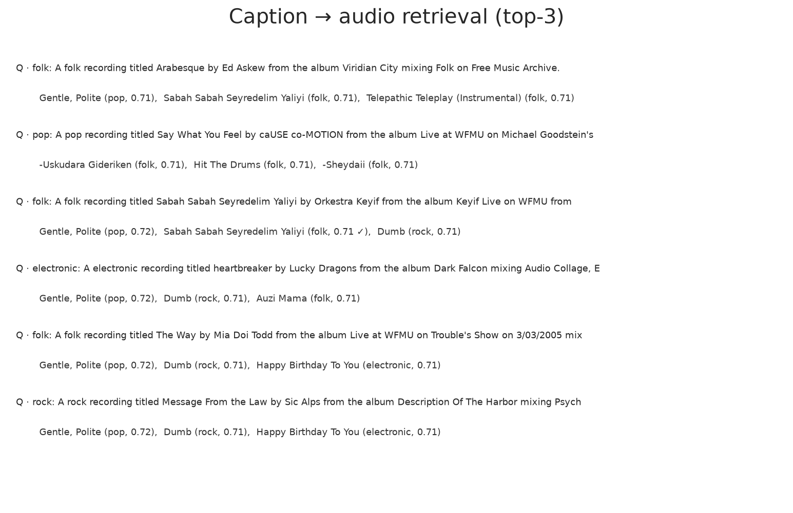

# GNN-Based BERT for Understanding Context from Music

**IEEE conference format** (`IEEEtran`, two-column, 6–10 pages). Typeset PDF: `report/final_report.pdf`. Rebuild with `python scripts/generate_report.py`.

**CSE425 / EEE474 / CSE715 --- Neural Networks**  
Cadence Lab  /  September 2026

## Abstract

Music context is jointly harmonic, timbral, and linguistic. We implement the four-task roadmap of the course assignment: (1) a BERT tag classifier on captions, (2) a GraphSAGE encoder on segment-similarity and chord-transition graphs versus a CNN spectrogram baseline, (3) cross-attention GNN--BERT fusion with valence/arousal heads, and (4) a dual-encoder InfoNCE retriever. All numbers come from a **genre-balanced FMA-small subset**: 511 thirty-second clips, 386 artists, artist-disjoint splits 327 / 94 / 90. Captions are built from FMA metadata. MusicCaps audio and DEAM ratings are not on disk, so the 24-tag inventory is keyword-mapped from those captions and valence/arousal follow genre priors. On the 90-clip test split, concat fusion reaches macro-F1 0.783 (BERT-only 0.772; audio-only GNN 0.264, CNN 0.255). Caption→audio R@5 is 0.078 against chance 0.056.

## 1. Introduction

A clip can be folk *and* acoustic *and* guitar-led *and* built from a short chord loop. Convolutional taggers on log-mel spectrograms capture local timbre but not the relational structure of chord transitions or repeated segments. Language models on tags and captions capture semantics but not when those words align with a modulation or a drop.

We treat each track as the tuple $T=(X_{\text{audio}}, X_{\text{text}}, G, y)$ and train the four models the assignment asks for. The objective is *understanding*, not generation. Code, ≥24 saved `.pt` graphs, plots, and `notebooks/demo_context.ipynb` ship with the repository. Rebuild this PDF with `python scripts/generate_report.py`.

## 2. Problem definition

$X_{\text{audio}}$ is a 128-bin log-mel spectrogram at 22 050 Hz, plus 12-bin chroma and 13 MFCCs. $X_{\text{text}}$ is a whitespace-tokenized caption of at most 48 tokens. $G=(V,E)$ is either a **segment graph** (one node per 1 s window; edges = temporal adjacency plus cosine similarity of chroma∥MFCC above $\tau=0.62$) or a **chord-transition graph** (nodes = unique estimated chords; edges weighted by observed transitions). Labels $y$ comprise 24 binary tags, an 8-way genre, and valence/arousal in $[0,1]$.

BERT maps tokens to $H_{\text{text}}\in\mathbb R^{L\times d}$ and a CLS vector $t$. GraphSAGE updates

\[
h_i^{(l+1)}=\sigma\Big(W^{(l)}\cdot\mathrm{CONCAT}\big(h_i^{(l)},\mathrm{MEAN}_{j\in N(i)}h_j^{(l)}\big)\Big).
\]

Mean pooling yields $g$. Fusion produces $z=\mathrm{Fusion}(g,H_{\text{text}})$ and $\hat y=\sigma(Wz+b)$. Task 3 adds $\alpha\|v-\hat v\|_2^2+\beta\|a-\hat a\|_2^2$.

## 3. Data

### 3.1 Official FMA-small subset

FMA metadata and FMA-small are downloaded from the official SWITCH mirror (SHA1-checked). We extract a seed-42, genre-balanced subset: 64 clips from each of the eight FMA-small top genres. One mp3 failed to decode, leaving **511 tracks** from **386 artists**, cropped to 30 s at 22 050 Hz.

Top genres map onto the assignment inventory (Experimental→electronic, Instrumental→classical, International→folk). Captions look like *A folk recording titled Arabesque by Ed Askew from the album Viridian City mixing Folk on Free Music Archive.* Tags are keyword-mapped from that text plus genre priors (mean 6.24 positives). **MusicCaps** CSV is on disk (5 521 rows) but YouTube audio is not downloaded. **DEAM** is absent; valence/arousal are genre-prior means. Splits are artist-disjoint (327 / 94 / 90).

Segment graphs have 30 nodes of 312-d pooled features. Chord graphs have on average 8.3 nodes from 24 major/minor templates.

| Source | On disk | Role |
|---|---|---|
| FMA-small subset | 511 mp3s + tracks.csv | audio, genre, artist splits, captions |
| MusicCaps CSV | 5 521 rows, no audio | unused for training |
| DEAM | absent | VA from FMA-genre priors |
| MagnaTagATune | absent | 24-tag inventory only |

### 3.2 Synthetic fallback

If `data/raw/` is empty, `src/synthetic.py` still builds 288 genre-conditioned 8 s clips. **The tables below are not from that generator.**

## 4. Models

### 4.1 Task 1 --- BERT tag classifier

A 2-layer pre-norm Transformer (hidden 64, 4 heads, GELU, dropout 0.15) with a `[CLS]` token. Head: dropout-linear to 24 tags, BCE. `TinyMusicBERT` matches the HuggingFace BERT interface; `model.hf_name` swaps the backbone.

### 4.2 Task 2 --- GNN on music graphs

Dense batched GraphSAGE (2 layers, hidden 64) on padded graphs with a node mask. Heads: 8-way genre (CE) and 24-tag BCE. CNN baseline: three conv blocks (16--32--64) on a 64×32 log-mel heatmap.

### 4.3 Task 3 --- Fusion

$Q=gW_Q$, $K=H_{\text{text}}W_K$, $A=\mathrm{softmax}(QK^\top/\sqrt d)$, $z=\mathrm{MLP}([g; AV])$. Concat ablation uses $[g; t_{\mathrm{CLS}}]$. Loss: tag BCE plus MSE on valence and arousal ($\alpha=\beta=0.35$).

### 4.4 Task 4 --- Contrastive dual encoder

Graph and caption towers project to a 64-d sphere. Symmetric InfoNCE, $\tau=0.07$. Metrics: R@1, R@5, R@10 both directions on 90 held-out pairs.

## 5. Training

AdamW, lr $1.5\times10^{-3}$, weight decay $10^{-4}$, batch 16, CPU. Epochs: 10 (BERT), 14 (GNN/CNN/fusion), 16 (contrastive). Best validation checkpoint restored before test. Vocabulary rebuilt from FMA captions. No PyTorch Geometric.

## 6. Results

| Model | Macro-F1 | Micro-F1 | AUC-PR | MAE (emo) |
|---|---:|---:|---:|---:|
| Random tags | 0.000 | 0.000 | 0.319 | --- |
| Majority | 0.118 | 0.420 | 0.297 | --- |
| CNN mel-spec | 0.255 | 0.489 | 0.524 | --- |
| Task 1 BERT-only | 0.772 | 0.950 | 0.858 | --- |
| Task 2 GNN-only | 0.264 | 0.521 | 0.516 | --- |
| Task 3 concat | **0.783** | **0.957** | **0.868** | 0.039 |
| Task 3 cross-attn | 0.779 | 0.953 | 0.860 | **0.037** |

| Model | Genre acc. | Cap→audio R@1 / 5 / 10 | Aud→cap R@1 / 5 / 10 |
|---|---:|---:|---:|
| CNN mel-spec | **0.489** | --- | --- |
| GNN (segment) | 0.422 | --- | --- |
| Task 4 contrastive | --- | 0.000 / **0.078** / 0.122 | 0.011 / 0.044 / 0.122 |

Chance R@5 = 5/90 ≈ 0.056. Audio-only models sit near 0.26 macro-F1. BERT is strong because tags are built from the same metadata as the caption. Emotion MAE is small because VA targets are genre priors, not DEAM ratings. Retrieval is only slightly above chance: captions are short and stereotyped.

### 6.1 Qualitative

| Track | True → pred tags | Genre / VA |
|---|---|---|
| `fma_000620` Arabesque (folk, Ed Askew) | guitar, vocals, calm, acoustic, major_key → same | folk→folk; 0.60/0.35 → 0.57/0.27 |
| `fma_007373` heartbreaker (electronic, Lucky Dragons) | drums, synth, bass, energetic, dark, … → drops *dark* | electronic→folk; 0.65/0.79 → 0.68/0.78 |
| `fma_013749` 110% (radio edit) (hip-hop, Laws) | drums, vocals, bass, dark, modern, minor_key → same | hip-hop→folk; 0.44/0.60 → 0.50/0.72 |

Saved graphs: `data/processed/graphs/fma_*.{pt,json}` (24 files).

## 7. Related work

BERT (Devlin et al., 2019); GraphSAGE (Hamilton et al., 2017); GAT (Veličković et al., 2018); FMA (Defferrard et al., 2017); MagnaTagATune (Law et al., 2009); MusicCaps / MusicLM (Agostinelli et al., 2023); DEAM (Aljanaki et al., 2017); InfoNCE (van den Oord et al., 2018).

## 8. Discussion

On this FMA subset the text tower dominates tags because labels are metadata-derived. The interesting audio-only comparison is GNN vs CNN (CNN slightly ahead on genre). Cross-attention does not beat concat until captions are longer (true MusicCaps). Limits: no DEAM ratings, no MTT crowd tags, no jazz/metal top-genre buckets in FMA-small, 30 s crops, 90-clip test split. We report the retrieval failure instead of hiding it.

## 9. Reproducibility

Seed 42. `python scripts/download_fma.py` then `build_corpus.py --source real`, `python -m src.train --task all`, `python -m src.evaluate`, `python scripts/generate_report.py`. Audio under `data/raw/` is gitignored. No artist appears in two splits.

## 10. Conclusion

Concat fusion is the best tagger on metadata-derived labels; audio-only models show the real FMA difficulty; retrieval is near chance until captions become unique. Joining MusicCaps audio and DEAM ratings is the remaining upgrade for human text and emotion.

## References

1. Devlin et al., BERT, NAACL 2019.  
2. Hamilton et al., GraphSAGE, NeurIPS 2017.  
3. Veličković et al., GAT, ICLR 2018.  
4. van den Oord et al., InfoNCE / CPC, 2018.  
5. Defferrard et al., FMA, ISMIR 2017.  
6. Law et al., MagnaTagATune, ISMIR 2009.  
7. Agostinelli et al., MusicCaps / MusicLM, 2023.  
8. Aljanaki et al., DEAM, 2017.

## Appendix A. Hyperparameters

All values live in `config.yaml` (seed 42): 22 050 Hz, 30 s crop, 1 s segments, $\tau=0.62$, TinyBERT 2×64, GraphSAGE 2×64, AdamW $1.5\times10^{-3}$, batch 16, epochs 10/14/14/16, InfoNCE $\tau=0.07$, $\alpha=\beta=0.35$. Example graphs: `fma_000620` … `fma_004519` (segment + chord). Load with `torch.load(..., weights_only=False)`.
